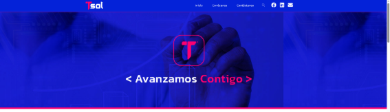
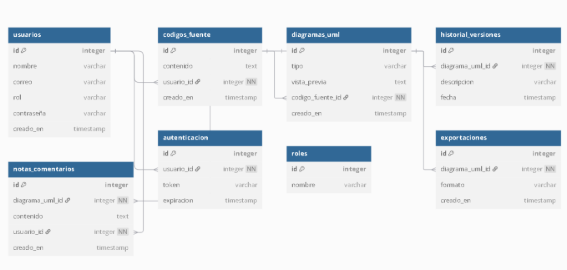

**UNIVERSIDAD PRIVADA DE TACNA**

**FACULTAD DE INGENIERÍA**

**Escuela Profesional de Ingeniería de Sistemas**

**Plataforma Avanzada para la Generación Automática de Diagramas UML para la empresa Tech Solutions**

Curso: Patrones de Software

Docente: Mag. Patrick Cuadrados

Integrantes:

\- Alexis Jeanpierre Martínez Vargas			(2019063638)

\- Juan José David Pérez Vizcarra				(2019063636)

\- Jhon Thomas Ticona Chambi				(2018062232)

**Tacna-Perú**

**2025**

**Plataforma Avanzada para la Generación Automática de Diagramas UML para la empresa Tech Solutions**

**Documento SRS**

**Versión 1.5**

***Presentado Por:***

*Martínez Vargas, Alexis Jeanpierre*

*Documentador*

*2025*

|**Control de Versiones**||||||
| :-: | :- | :- | :- | :- | :- |
|**Versión**|**Hecha por**|**Revisada por**|**Aprobada por**|**Fecha**|**Motivo**|
|1\.0|AMV|AMV, JTC|JTC|31/03/2025|Versión Inicial|
|1\.5|AMV|AMV, JTC|JTC|27/04/2025|Versión Modificada|

# **INDICE GENERAL**
[INTRODUCCION	5](#_toc196740471)

[I. Generalidades de la Empresa	5](#_toc196740472)

[1. Nombre de la Empresa	5](#_toc196740473)

[2. Visión	5](#_toc196740474)

[3. Misión	5](#_toc196740475)

[4. Organigrama	6](#_toc196740476)

[II. Visionamiento de la Empresa	6](#_toc196740477)

[1. Descripción del Problema	6](#_toc196740478)

[2. Objetivos de Negocios	7](#_toc196740479)

[3. Objetivos de Diseño	7](#_toc196740480)

[4. Alcance del proyecto	7](#_toc196740481)

[5. Viabilidad del Sistema	8](#_toc196740482)

[6. Información obtenida del Levantamiento de información	8](#_toc196740483)

[6.1. Lectura de Antecedentes	8](#_toc196740484)

[III.  Análisis de Procesos	11](#_toc196740485)

[a) Diagrama del Proceso Actual – Diagrama de actividades	11](#_toc196740486)

[b) Diagrama del Proceso Propuesto – Diagrama de actividades Inicial	11](#_toc196740487)

[IV Especificación de Requerimientos de Software	12](#_toc196740488)

[a) Cuadro de Requerimientos funcionales Inicial	12](#_toc196740489)

[b) Cuadro de Requerimientos No funcionales	13](#_toc196740490)

[c) Cuadro de Requerimientos funcionales Final	14](#_toc196740491)

[d) Reglas de Negocio	15](#_toc196740492)

[V Fase de Desarrollo	16](#_toc196740493)

[1. Perfiles de Usuario	16](#_toc196740494)

[2. Modelo Conceptual	17](#_toc196740495)

[a) Diagrama de Paquetes	18](#_toc196740496)

[b) Diagrama de Casos de Uso	18](#_toc196740497)

[c) Historia de Usuarios, Criterios de Aceptación y Escenarios de Pruebas	20](#_toc196740498)

[d) Escenarios de Caso de Uso (narrativa)	24](#_toc196740499)

[3. Modelo Lógico	34](#_toc196740500)

[a) Análisis de Objetos	34](#_toc196740501)

[b) Diagrama de Entidad-Relación	35](#_toc196740502)

[c) Diagrama de Secuencia	36](#_toc196740503)

[d) Diagrama de Clases	40](#_toc196740504)

[CONCLUSIONES	40](#_toc196740505)

[RECOMENDACIONES	41](#_toc196740506)

[BIBLIOGRAFIA	41](#_toc196740507)

[WEBGRAFIA	41](#_toc196740508)

# **INTRODUCCION**
Tech Solutions, empresa especializada en el desarrollo de soluciones tecnológicas innovadoras, busca optimizar la creación y gestión de documentos técnicos mediante la implementación de una plataforma basada en inteligencia artificial (IA). Este proyecto tiene como objetivo desarrollar un sistema web avanzado que automatice la generación de informes técnicos, reduciendo el esfuerzo manual y garantizando precisión, coherencia y estandarización en los documentos.

La plataforma permitirá a los usuarios generar documentos de manera estructurada a partir de plantillas predefinidas y configurables, facilitando la personalización y optimización del contenido. Además, integrará herramientas de IA para mejorar la redacción, detectar errores y sugerir ajustes en función del contexto del documento.

Con este desarrollo, Tech Solutions podrá ampliar su oferta de productos y servicios, proporcionando a sus clientes una solución innovadora que mejore la productividad y eficiencia en la gestión documental.
# **I. Generalidades de la Empresa**
## **1. Nombre de la Empresa**
Tech Solutions
## **2. Visión**
Ser la empresa líder en ciberseguridad en la región, brindando soluciones innovadoras y de confianza. 
## **3. Misión**
Posicionarnos como la empresa líder en la región, ofreciendo servicios y soluciones de ciberseguridad altamente especializadas, diseñadas para proteger de manera integral los recursos tecnológicos de nuestros clientes y asegurar la continuidad de su operación.
## **4. Organigrama**
*Figura 1: Organigrama de Tech Solutions*

*Fuente: Sacado de la página de Tech Solutions*
# **II. Visionamiento de la Empresa**
## **1. Descripción del Problema**
Tech Solutions busca abordar las dificultades que enfrentan estudiantes y profesionales en la creación de diagramas UML, tales como:

🔹 La generación manual de diagramas UML a partir de código, lo que consume tiempo y es propenso a errores.

🔹 La falta de validaciones en tiempo real, lo que puede llevar a diagramas incorrectos o incoherentes.

🔹 La limitada integración con herramientas de desarrollo y control de versiones como Git.

🔹 La ausencia de opciones de colaboración en tiempo real para la creación conjunta de diagramas.

Para resolver estos problemas, Tech Solutions desarrollará una Plataforma Avanzada para la Generación Automática de Diagramas UML, la cual permitirá a los usuarios generar, validar y modificar diagramas UML de manera eficiente sin necesidad de herramientas externas.
## **2. Objetivos de Negocios**
- Automatizar la generación de diagramas UML a partir de código fuente en diversos lenguajes como C#, Java y Python.
- Optimizar el proceso de aprendizaje mediante un motor de validación en tiempo real que ayude a los usuarios a crear diagramas correctos.
- Facilitar la colaboración en tiempo real, permitiendo que varios usuarios editen un mismo diagrama simultáneamente.
- Integrar la plataforma con repositorios Git, permitiendo la generación de diagramas UML basados en el historial de cambios del código.
- Permitir la extensibilidad mediante soporte para plugins, lo que facilitará la incorporación de nuevos lenguajes y reglas de análisis.
## **3. Objetivos de Diseño**
- Desarrollar una interfaz gráfica intuitiva con herramientas asistidas para la construcción de diagramas UML.
- Implementar validaciones en tiempo real, asegurando que los diagramas generados cumplan con las reglas de UML.
- Integrar reglas configurables para la conversión automática de código a UML sin necesidad de IA.
- Optimizar el rendimiento del sistema, permitiendo la carga y edición de diagramas grandes sin afectar la fluidez de la plataforma.
- Garantizar la escalabilidad y compatibilidad, facilitando la integración con herramientas de terceros mediante modelos en JSON y YAML.
## **4. Alcance del proyecto**
- Desarrollo de una Plataforma Web o de Escritorio accesible desde cualquier dispositivo con conexión a Internet.
- Soporte para Diversos Diagramas UML, incluyendo diagramas de clases, casos de uso, secuencia y componentes.
- Motor de Validación en Tiempo Real que detecte errores estructurales y relacionales en los diagramas.
- Conversión Automática de Código a UML, utilizando reglas configurables en lugar de IA.
- Modo de Colaboración en Tiempo Real, permitiendo que varios usuarios editen simultáneamente.
- Integración con Repositorios Git, generando diagramas basados en el historial de cambios del código.
- Soporte para Plugins, permitiendo a los usuarios personalizar la plataforma agregando compatibilidad con nuevos lenguajes o modelos.
## **5. Viabilidad del Sistema**
Tras un exhaustivo análisis de viabilidad, se ha determinado que el desarrollo e implementación del proyecto es completamente viable, sustentado por los siguientes aspectos:

📌 **Viabilidad Técnica**: La plataforma será desarrollada con tecnologías modernas que permitan la integración con repositorios de código y herramientas UML.
📌 **Viabilidad Económica**: Se espera que la plataforma genere valor al reducir el tiempo y esfuerzo en la creación de diagramas, lo que la hace viable a largo plazo.
📌 **Viabilidad Operativa**: Su diseño intuitivo permitirá que estudiantes y profesionales adopten la herramienta sin necesidad de capacitación avanzada.
📌 **Viabilidad Legal**: Cumplirá con normativas de protección de datos y licencias de software para asegurar un uso ético y legal de la información.
## **6. Información obtenida del Levantamiento de información**
### **6.1. Lectura de Antecedentes**
Es una técnica de muy buena utilidad porque permite prepararse e informarse acerca de la organización de la empresa y sus reglas dentro de la organización. La técnica fue utilizada para entender cómo funciona la empresa y en específico, sobre el área de ventas y almacén.

**Página Web de la Empresa Tech Solutions**

 

**Página de Ubicación de la Empresa Tech Solutions**

# **III.  Análisis de Procesos**
## **a) Diagrama del Proceso Actual – Diagrama de actividades**
*Figura 2: Diagrama de Actividad del Proceso Actual de Generar Diagramas de Proyectos Informáticos de la Empresa Tech Solutions*

Fuente: Elaboración Propia
## **b) Diagrama del Proceso Propuesto – Diagrama de actividades Inicial**
*Figura 3: Diagrama de Actividad del Proceso Propuesto de Generar Diagramas de Proyectos Informáticos de la Empresa Tech Solutions*

Fuente: Elaboración Propia
# **IV Especificación de Requerimientos de Software**
## **a) Cuadro de Requerimientos funcionales Inicial**
*Tabla 1: Cuadro de Requisitos Funcionales Inicial del Proyecto Plataforma Avanzada para la Generación Automática de Diagramas UML para la empresa Tech Solutions*

<table><tr><th><b>Módulo</b></th><th><b>Nro. RF</b></th><th><b>Requerimiento Funcional</b></th><th><b>CUS</b></th><th><b>Prioridad</b></th></tr>
<tr><td rowspan="2"><b>Módulo Seguridad</b></td><td>RF01</td><td>Permitir la autenticación de los usuarios mediante credenciales.</td><td>Validar Usuario</td><td>Alta</td></tr>
<tr><td>RF02</td><td>Gestionar el registro de nuevos usuarios en la plataforma.</td><td>Gestionar Usuario</td><td>Media</td></tr>
<tr><td rowspan="4"><b>Módulo Generación UML</b></td><td>RF03</td><td>Generar diagramas de clases automáticamente a partir de código fuente.</td><td>Generar UML</td><td>Alta</td></tr>
<tr><td>RF04</td><td>Permitir la importación de modelos en JSON/YAML para la generación de diagramas.</td><td>Importar Modelos</td><td>Alta</td></tr>
<tr><td>RF05</td><td>Generar diagramas de casos de uso a partir de estructuras predefinidas.</td><td>Generar UML</td><td>Media</td></tr>
<tr><td>RF06</td><td>Generar diagramas de secuencia analizando interacciones en código fuente.</td><td>Generar UML</td><td>Alta</td></tr>
<tr><td rowspan="2"><b>Módulo Edición y Validación</b></td><td>RF07</td><td>Permitir la edición manual de los diagramas generados.</td><td>Editar Diagramas</td><td>Media</td></tr>
<tr><td>RF08</td><td>Implementar validaciones en tiempo real para evitar errores de sintaxis y relaciones inválidas.</td><td>Validar Diagramas</td><td>Alta</td></tr>
<tr><td rowspan="2"><b>Módulo Colaboración</b></td><td>RF09</td><td>Permitir que múltiples usuarios editen un mismo diagrama en tiempo real.</td><td>Colaborar en Diagramas</td><td>Alta</td></tr>
<tr><td>RF10</td><td>Asignar colores distintos a cada usuario para identificar sus cambios.</td><td>Visualizar Cambios</td><td>Media</td></tr>
<tr><td><b>Módulo Integración con Repositorios</b></td><td>RF11</td><td>Conectarse con repositorios Git y generar diagramas UML basados en cambios recientes del código.</td><td>Integrar con Git</td><td>Alta</td></tr>
<tr><td><b>Módulo Extensibilidad</b></td><td>RF12</td><td>Permitir la creación de plugins para soportar nuevos lenguajes de programación.</td><td>Extender Plataforma</td><td>Media</td></tr>
</table>

*Fuente: Elaboración Propia*
## **b) Cuadro de Requerimientos No funcionales**
*Tabla 2: Cuadro de Requisitos No Funcionales del Proyecto Web de gestión de Inventario y Elaboración de Informes Técnicos implementado con IA para la municipalidad Distrital de Pocollay (EFTIC)*

<table><tr><th><b>Nro. Rnf</b></th><th><b>Requerimientos no Funcional</b></th><th><b>Descripción del Requerimiento No Funcional</b></th></tr>
<tr><td rowspan="2">Rnf01</td><td rowspan="2">Rendimiento</td><td>El sitio web debe tener un tiempo de carga máximo de 2 segundos para garantizar una experiencia de usuario fluida.</td></tr>
<tr><td>El sistema debe ser capaz de manejar hasta 1000 usuarios concurrentes sin degradación significativa del rendimiento.</td></tr>
<tr><td rowspan="2">Rnf02</td><td rowspan="2">Seguridad</td><td>El sitio web debe implementar medidas de seguridad, como cifrado SSL, para proteger los datos de los usuarios.</td></tr>
<tr><td>Debe haber una política de contraseñas seguras que requiera contraseñas fuertes para los usuarios registrados.</td></tr>
<tr><td>Rnf03</td><td>Disponibilidad</td><td>El sitio web debe estar disponible las 24 horas del día, los 7 días de la semana, con un tiempo de inactividad planificado mínimo.</td></tr>
<tr><td rowspan="2">Rnf04</td><td rowspan="2">Usabilidad</td><td>El diseño y la interfaz de usuario del sitio web deben ser intuitivos y fáciles de usar para niños, con elementos visuales atractivos.</td></tr>
<tr><td>El sitio debe ser accesible desde dispositivos móviles y tabletas, además de computadoras de escritorio.</td></tr>
<tr><td>Rnf05</td><td>Compatibilidad</td><td>El sitio web debe ser compatible con los principales navegadores web, como Chrome, Firefox, Edge y Safari.</td></tr>
</table>

*Fuente: Elaboración Propia*	
## **c) Cuadro de Requerimientos funcionales Final**
*Tabla 3: Cuadro de Requisitos Funcionales Final del Proyecto Plataforma Avanzada para la Generación Automática de Diagramas UML para la empresa Tech Solutions*

<table><tr><th><b>Nombre</b></th><th><b>Código</b></th><th><b>Descripción</b></th><th><b>Sistema</b></th><th><b>Prioridad</b></th></tr>
<tr><td>RF-01</td><td rowspan="2"><b>Selección de Opciones</b></td><td>Elegir el tipo de diagrama UML a generar: Clases, Secuencia, Casos de Uso, Componentes.</td><td>Plataforma Web</td><td>Alta</td></tr>
<tr><td>RF-02</td><td>Soporte para múltiples lenguajes de programación (C#, Java, Python, etc.).</td><td>Plataforma Web</td><td>Alta</td></tr>
<tr><td>RF-03</td><td><b>Generación de UML</b></td><td>Convertir automáticamente el código pegado en un diagrama UML con vista previa en tiempo real.</td><td>Plataforma Web</td><td>Alta</td></tr>
<tr><td>RF-04</td><td><b>Edición y Personalización</b></td><td>Permitir la edición manual del diagrama generado, añadiendo o eliminando nodos, relaciones o notas.</td><td>Plataforma Web</td><td>Alta</td></tr>
<tr><td>RF-05</td><td><b>Colaboración</b></td><td>Permitir compartir diagramas UML en tiempo real con otros usuarios para edición conjunta.</td><td>Plataforma Web</td><td>Media</td></tr>
<tr><td>RF-06</td><td><b>Exportación</b></td><td>Guardar diagramas en diferentes formatos: PNG, SVG, PDF o en código PlantUML/Mermaid.</td><td>Plataforma Web</td><td>Alta</td></tr>
<tr><td>RF-07</td><td><b>Historial y Versionado</b></td><td>Permitir la reversión a versiones anteriores del diagrama para recuperar cambios previos.</td><td>Plataforma Web</td><td>Media</td></tr>
<tr><td>RF-08</td><td><b>Comentarios y Notas</b></td><td>Posibilidad de añadir anotaciones o notas técnicas a los elementos del diagrama UML.</td><td>Plataforma Web</td><td>Baja</td></tr>
<tr><td>RF-09</td><td><b>Validaciones</b></td><td>Alertar si el código pegado tiene errores de sintaxis que impiden la generación del diagrama.</td><td>Plataforma Web</td><td>Alta</td></tr>
<tr><td>RF-10</td><td><b>Seguridad y Acceso</b></td><td>Implementar autenticación de usuarios con roles de acceso (Invitado, Usuario, Administrador).</td><td>Plataforma Web</td><td>Alta</td></tr>
</table>

*Fuente: Elaboración Propia*

## **d) Reglas de Negocio**
*Tabla 4: Cuadro de Reglas de Negocio de la Empresa Tech Solutions*

|**BR ID**|**Tipo de Regla del Negocio**|**Nombre de la Regla de Negocio**|**Descripción**|**Casos de Uso / Reglas Aplicadas**|
| :-: | :-: | :-: | :-: | :-: |
|**RN01**|Regla de Estructura|Registro de Usuarios|Todo usuario debe ser registrado en el sistema con sus datos completos, incluyendo nombre, correo y tipo de usuario (Invitado, Usuario, Administrador).|Iniciar Sesión, Gestionar Usuarios|
|**RN02**|Regla de Estructura|Permiso de Edición|Solo los usuarios con rol de Administrador pueden modificar o eliminar diagramas creados por otros usuarios.|Gestionar Usuarios, Gestionar Diagramas|
|**RN03**|Regla de Estructura|Soporte Multilenguaje|El sistema debe soportar la entrada de código en múltiples lenguajes de programación, incluyendo C#, Java, Python y JavaScript.|Gestionar Diagramas|
|**RN04**|Regla de Proceso|Generación Automática de Diagramas|Los diagramas UML deben generarse automáticamente a partir del código fuente pegado, con vista previa en tiempo real.|Generar Diagrama UML|
|**RN05**|Regla de Proceso|Edición Manual de Diagramas|Los usuarios deben poder modificar manualmente los diagramas generados, añadiendo o eliminando nodos, relaciones o notas.|Editar Diagrama UML|
|**RN06**|Regla de Estructura|Modo Colaborativo|Los diagramas pueden ser compartidos con otros usuarios en tiempo real para edición conjunta.|Compartir Diagramas|
|**RN07**|Regla de Proceso|Exportación de Diagramas|Los diagramas generados deben poder exportarse en formato PNG, SVG, PDF o código PlantUML/Mermaid.|Exportar Diagrama UML|
|**RN08**|Regla de Proceso|Historial de Cambios|El sistema debe permitir a los usuarios revertir a versiones anteriores de un diagrama.|Gestionar Historial de Diagramas|
|**RN09**|Regla de Estructura|Comentarios y Anotaciones|Los usuarios deben poder añadir notas o comentarios en elementos específicos del diagrama UML.|Gestionar Notas en Diagramas|
|**RN10**|Regla de Proceso|Validación de Código|Antes de generar un diagrama, el sistema debe validar la sintaxis del código fuente y alertar sobre posibles errores.|Generar Diagrama UML|

*Fuente: Elaboración Propia*

# **V Fase de Desarrollo**
## **1. Perfiles de Usuario**
*Tabla 5. Descripción del Usuario*

|**Representante**|Profesional de Ingeniería de Sistemas encargado del área Desarrollo|
| - | - |
|**Descripción**|Personales responsables de los equipos tecnológicos|
|**Tipo**|Usuario|
|**Responsabilidades**|Participar en los servicios brindados por la consultoría.|
|**Criterio de Éxito**|A definir por el cliente|
|**Grado de participación**|A definir por el cliente|
|**Comentarios**|Ninguno|

*Fuente: Elaboración Propia*

*Tabla 6. Descripción del Usuario*

|**Representante**|Alumnos o estudiantes que hacen uso del Programa|
| - | - |
|**Descripción**|Persona que busca el servicio de Sistema|
|**Tipo**|Usuario|
|**Responsabilidades**|Participar en los servicios brindados por la consultoría.|
|**Criterio de Éxito**|A definir por el cliente|
|**Grado de participación**|A definir por el cliente|
|**Comentarios**|Ninguno|

`				`*Fuente: Elaboración Propia*
## **2. Modelo Conceptual**
*Figura 4: Imagen de Generalización de Redes acerca de Usuario que demuestra que el usuario que ingresa al Sistema es tanto el ingeniero del Área de Desarrollo como un Estudiante o Gerente*

*Fuente: Elaboración Propia*
## **a) Diagrama de Paquetes**
*Figura 5: Diagrama de Paquetes con los Módulos del Sistema Web Inventario*

*Fuente: Elaboración Propia*

Este diagrama de paquetes organiza de manera clara los módulos del sistema, dividiendo las funcionalidades en áreas clave como Interfaz de Usuario, Procesamiento, Edición y Colaboración, Exportación e Integración, y Seguridad y Administración. Cada paquete encapsula clases específicas que representan sus responsabilidades dentro del sistema, estableciendo relaciones lógicas entre ellas. La estructura facilita la comprensión del flujo del sistema, desde la entrada de código hasta la generación, edición, colaboración y exportación de diagramas UML, garantizando además seguridad y control de acceso.

## **b) Diagrama de Casos de Uso**
*Figura 6: Diagrama de Caso de Uso del Modulo Iniciar Sesión incluyendo la acción de validar Usuario*

*Fuente: Elaboración Propia*

*Figura 7: Diagrama de Caso de Uso del Modulo Gestionar Usuario que incluye la acción de Listar usuario y extensión de acciones de tipo Editar Usuarios, Agregar Usuarios y Eliminar Usuarios.*

*Fuente: Elaboración Propia*

*Figura 8: Diagrama de Caso de Uso del Módulo Gestionar Colaboración en Diagramas que incluye la acción de Compartir Diagrama en Tiempo Real y la extensión de Gestionar Historial de Versiones.*

*Fuente: Elaboración Propia*

*Figura 9: Diagrama de Caso de Uso del Módulo Gestionar Diagramas UML que incluye las acciones de Seleccionar Tipo de Diagrama y Generar Diagrama desde Código este a su vez incluye Seleccionar Lenguaje de Programación por otor lado en las extensiones son Editar Diagrama Manualmente, Añadir Comentarios, Exportar Diagrama y Validar Código Fuente.*

*Fuente: Elaboración Propia*
## **c) Historia de Usuarios, Criterios de Aceptación y Escenarios de Pruebas**
**Módulo: Iniciar Sesión**

**Historias de Usuario**

- **HU01**
  **Como** usuario registrado,
  **Quiero** iniciar sesión en la plataforma,
  **Para** acceder a las funcionalidades del sistema.
- **HU02**
  **Como** usuario,
  **Quiero** recibir un mensaje de error si ingreso datos incorrectos,
  **Para** saber que debo corregir mis credenciales.

**Criterios de Aceptación y Escenarios de Prueba (Gherkin)**

**- CA01:**

**DADO** que soy un usuario registrado

**CUANDO** ingreso mis credenciales correctamente

**ENTONCES** debo ser redirigido al panel principal del sistema.

**- CA02:**

**DADO** que soy un usuario

**CUANDO** ingreso una contraseña o correo incorrectos

**ENTONCES** el sistema debe mostrar un mensaje de error: "Credenciales incorrectas. Intente nuevamente."

**Módulo: Gestionar Usuario**

**Historias de Usuario**

- **HU03**
  **Como** administrador,
  **Quiero** registrar nuevos usuarios,
  **Para** permitirles acceder a la plataforma.
- **HU04**
  **Como** administrador,
  **Quiero** editar o eliminar usuarios,
  **Para** mantener actualizada la base de datos de usuarios.

**Criterios de Aceptación y Escenarios de Prueba (Gherkin)**

**- CA03:**

**DADO** que soy un administrador autenticado

**CUANDO** registro un nuevo usuario completando todos los campos requeridos

**ENTONCES** el nuevo usuario debe guardarse exitosamente en el sistema.

**- CA04:**

**DADO** que soy un administrador

**CUANDO** elimino un usuario existente

**ENTONCES** el sistema debe eliminar al usuario de la base de datos y actualizar la lista.

**- CA05:**

**DADO** que soy un administrador

**CUANDO** edito los datos de un usuario

**ENTONCES** el sistema debe guardar los cambios actualizados correctamente.

**Módulo: Gestionar Colaboración en Diagramas UML**

**Historias de Usuario**

- **HU05**
  **Como** creador de un diagrama UML,
  **Quiero** invitar a otros usuarios a colaborar,
  **Para** trabajar en conjunto en la edición del diagrama.
- **HU06**
  **Como** colaborador,
  **Quiero** ver y modificar diagramas compartidos conmigo,
  **Para** contribuir al desarrollo del proyecto.

**Criterios de Aceptación y Escenarios de Prueba (Gherkin)**

**- CA06:**

**DADO** que he creado un diagrama UML

**CUANDO** invito a un usuario a colaborar

**ENTONCES** el sistema debe enviar una invitación y otorgarle permisos de edición sobre el diagrama.

**- CA07:**

**DADO** que soy un colaborador autorizado

**CUANDO** accedo a un diagrama compartido

**ENTONCES** debo poder ver y modificar el diagrama en tiempo real.

**- CA08:**

**DADO** que soy un usuario no invitado

**CUANDO** intento acceder a un diagrama sin permiso

**ENTONCES** el sistema debe bloquear el acceso y mostrar un mensaje de acceso denegado.

**Módulo: Gestionar Diagramas UML**

**Historias de Usuario**

- **HU07**
  **Como** usuario,
  **Quiero** seleccionar el tipo de diagrama UML,
  **Para** iniciar la creación del modelo adecuado.
- **HU08**
  **Como** usuario,
  **Quiero** generar un diagrama automáticamente a partir de código fuente,
  **Para** ahorrar tiempo en la construcción manual.
- **HU09**
  **Como** usuario,
  **Quiero** editar manualmente un diagrama,
  **Para** personalizar su estructura según mis necesidades.
- **HU10**
  **Como** usuario,
  **Quiero** añadir comentarios a los elementos del diagrama,
  **Para** documentar detalles importantes.
- **HU11**
  **Como** usuario,
  **Quiero** exportar el diagrama en diferentes formatos,
  **Para** utilizarlo fuera de la plataforma.
- **HU12**
  **Como** usuario,
  **Quiero** validar el código fuente antes de generar diagramas,
  **Para** evitar errores en la construcción.

**Criterios de Aceptación y Escenarios de Prueba (Gherkin)**

**- CA09:**

**DADO** que estoy en la sección "Gestionar Diagramas UML"

**CUANDO** selecciono un tipo de diagrama

**ENTONCES** el sistema debe habilitar las opciones correspondientes para su creación o edición.

**- CA10:**

**DADO** que he pegado código fuente correcto

**CUANDO** elijo "Generar desde Código"

**ENTONCES** el sistema debe analizar el código y mostrar una vista previa del diagrama generado.

**- CA11:**

**DADO** que deseo modificar un diagrama manualmente

**CUANDO** utilizo las herramientas de edición

**ENTONCES** los cambios deben aplicarse y guardarse en tiempo real.

**- CA12:**

**DADO** que he seleccionado un elemento del diagrama

**CUANDO** añado un comentario

**ENTONCES** el sistema debe guardar y mostrar visualmente la nota en el diagrama.

**- CA13:**

**DADO** que he terminado de trabajar en un diagrama

**CUANDO** elijo exportarlo en formato PNG, SVG, PDF o código PlantUML/Mermaid

**ENTONCES** el sistema debe generar y descargar el archivo correctamente.

**- CA14:**

**DADO** que he ingresado código fuente

**CUANDO** valido el código

**ENTONCES** el sistema debe mostrar errores si existen, o confirmar que el código es válido.
## **d) Escenarios de Caso de Uso (narrativa)**
Modulo Iniciar Sesión:

|**Caso de Uso**|**Iniciar Sesión**|
| :- | :-: |
|**Tipo**|Básico|
|**Descripción**|El usuario debe ingresar su correo electrónico y contraseña para acceder al sistema. No se permite el registro de nuevos usuarios desde esta interfaz, ya que el acceso está destinado exclusivamente al personal autorizado. Si el usuario ya está logueado y no ha cerrado su sesión anterior, no podrá acceder nuevamente a la pantalla de inicio de sesión hasta que cierre sesión. En caso de no ingresar correctamente los datos, se mostrarán mensajes de error.|
|**Actores**|Usuario|
|**Precondiciones**|
El usuario debe estar registrado previamente en el sistema.

  Debe mostrarse la pantalla de inicio de sesión al intentar ingresar al sistema, siempre que el usuario no esté ya logueado.
|
|**Post condiciones**|
El usuario es redirigido a la página principal (Home) si la autenticación es correcta.

Si los datos no son válidos, se muestra un mensaje de error.
|
|***Flujo normal de eventos Validar Usuario***||
|**Acción del actor**|**Respuesta del sistema**|
|1\. El usuario accede a la interfaz de inicio de sesión.||

|2\. Muestra una pantalla con dos campos de entrada: uno para ingresar el "Correo Electrónico" y otro para ingresar la "Contraseña". En ambos campos se muestran textos de ayuda: "Ingrese su correo electrónico" y "Ingrese su contraseña". El campo de contraseña incluye un botón para visualizar temporalmente la contraseña escrita. Además, se muestra un botón "Iniciar Sesión".|
| :-: |

|||
| :-: | :-: |

||
| :-: |

|||
| :-: | :-: |
|||

|3\. El usuario ingresa su "Correo Electrónico" y "Contraseña".|
| :-: |

|||
| :-: | :-: |

||
| :-: |

|||
| :-: | :-: |

||
| :-: |

|||
| :-: | :-: |

||
| :-: |

|||
| :-: | :-: |
|||

|4\. El usuario hace clic en el botón "INICIAR SESIÓN".|
| :-: |

|||
| :-: | :-: |

||
| :-: |

|||
| :-: | :-: |

|5\. El Sistema valida que ambos campos estén llenos.|
| :-: |

|||
| :-: | :-: |

||
| - |

|||
| :-: | :-: |
|||

|6\. El sistema verifica si el correo y la contraseña ingresados son correctos. Si los datos son válidos, redirige al usuario a la página principal (Home).|
| :-: |

|||
| :-: | :-: |
|||

|7\. Registra la entrada del usuario en el sistema.|
| :- |

|||
| :-: | :-: |
|***Flujo Alternativo A-1***||
|**Acción del actor**|**Respuesta del sistema**|
|1\. El usuario deja vacío uno o ambos campos (correo o contraseña).|2\. El sistema muestra el mensaje: "El correo electrónico o la contraseña ingresados no son válidos. Verifique sus datos."|
|***Flujo de Excepción E-1***||
|**Acción del actor**|**Respuesta del sistema**|
|||

|1\. El usuario deja vacío uno o ambos campos (correo o contraseña).|
| - |

|||
| - | :-: |

||
| - |

||2\. El sistema muestra el mensaje: "El correo electrónico o la contraseña ingresados no son válidos. Verifique sus datos."|
| - | :-: |
|***PROTOTIPO INICIO DE SESION***||
|||

<table><tr><th><b>Caso de Uso</b></th><th colspan="3"><b>Gestionar Usuarios</b></th></tr>
<tr><td><b>Tipo</b></td><td colspan="3">Básico</td></tr>
<tr><td><b>Descripción</b></td><td colspan="3">Este caso de uso permite a los usuarios con permisos de soporte agregar nuevos usuarios, editar información de usuarios existentes, y eliminar usuarios. La lista de usuarios está siempre visible para su consulta y gestión.</td></tr>
<tr><td><b>Actores</b></td><td colspan="3">Usuario</td></tr>
<tr><td rowspan="2"><b>Precondiciones</b></td><td colspan="3">El usuario debe haber iniciado sesión anteriormente.</td></tr>
<tr><td colspan="3">El sistema debe estar conectado a la base de datos para realizar operaciones de gestión de usuarios.</td></tr>
<tr><td><b>Post condiciones</b></td><td colspan="3">El sistema actualizará y mostrará la lista de usuarios tras cada operación exitosa.</td></tr>
<tr><td></td><td colspan="3">Si ocurre un error, se regresará a la vista anterior y se mostrará un mensaje de error.</td></tr>
<tr><td colspan="3"><b><i>Flujo normal de eventos - Agregar Usuario</i></b></td></tr>
<tr><td colspan="2"><b>Acción del actor</b></td><td><b>Respuesta del sistema</b></td></tr>
<tr><td colspan="2">1\. El usuario accede a la sección "Gestión de Usuarios".</td><td>2\. El sistema muestra la lista de usuarios con un botón "Agregar Usuario".</td></tr>
<tr><td colspan="2">3\. El usuario hace clic en el botón "Agregar Usuario".</td><td>4\. El sistema abre un formulario vacío para registrar un nuevo usuario.</td></tr>
<tr><td colspan="2">5\. El usuario completa los campos requeridos: Nombre, Apellido, Correo Electrónico, Contraseña, Rol.</td><td>6\. El sistema valida que los datos sean correctos y que el correo no esté repetido.</td></tr>
<tr><td colspan="2">7\. El usuario presiona el botón "Guardar".</td><td>8\. El sistema registra el nuevo usuario en la base de datos.</td></tr>
<tr><td colspan="2"></td><td>9\. El sistema muestra un mensaje de confirmación: "Usuario agregado exitosamente".</td></tr>
<tr><td colspan="2"></td><td>10\. El sistema actualiza y muestra nuevamente la lista de usuarios.</td></tr>
<tr><td colspan="3"><b>Flujo Alternativo A-1 - Campos incompletos</b></td></tr>
<tr><td colspan="2"><b>Acción del actor</b></td><td><b>Respuesta del sistema</b></td></tr>
<tr><td colspan="2">1\. El usuario intenta guardar el registro sin llenar todos los campos obligatorios.</td><td>2\. El sistema interrumpe la acción y muestra un mensaje indicando que los campos faltantes deben ser llenados antes de proceder.</td></tr>
<tr><td colspan="3"><b><i>Flujo normal de eventos - Editar/Modificar Usuario</i></b></td></tr>
<tr><td colspan="2">1\. El usuario accede a la sección "Gestión de Usuarios".</td><td>2\. El sistema muestra la lista de usuarios registrados.</td></tr>
<tr><td colspan="2">3\. El usuario selecciona un usuario existente de la lista.</td><td>4\. El sistema habilita la opción "Editar Usuario".</td></tr>
<tr><td colspan="2">5\. El usuario hace clic en "Editar Usuario".</td><td>6\. El sistema muestra un formulario prellenado con los datos del usuario seleccionado.</td></tr>
<tr><td colspan="2">7\. El usuario modifica los campos deseados.</td><td>8\. El sistema valida que los datos modificados sean correctos.</td></tr>
<tr><td colspan="2">9\. El usuario presiona el botón "Guardar Cambios".</td><td>10\. El sistema actualiza los datos del usuario en la base de datos.</td></tr>
<tr><td colspan="2"></td><td>11\. El sistema muestra un mensaje de confirmación: "Usuario actualizado exitosamente".</td></tr>
<tr><td colspan="2"></td><td>12\. El sistema actualiza y muestra nuevamente la lista de usuarios.</td></tr>
<tr><td colspan="3"><b>Flujo Alternativo A-2 - Campos incompletos</b></td></tr>
<tr><td colspan="2"><b>Acción del actor</b></td><td><b>Respuesta del sistema</b></td></tr>
<tr><td colspan="2">1\. El usuario intenta guardar el registro sin llenar todos los campos obligatorios.</td><td>2\. El sistema interrumpe la acción y muestra un mensaje indicando que los campos faltantes deben ser llenados antes de proceder.</td></tr>
<tr><td colspan="3"><b><i>Flujo normal de eventos - Eliminar Usuario</i></b></td></tr>
<tr><td colspan="2">1\. El usuario accede a la sección "Gestión de Usuarios".</td><td>2\. El sistema muestra la lista de usuarios registrados.</td></tr>
<tr><td colspan="2">3\. El usuario selecciona un usuario de la lista.</td><td>4\. El sistema habilita la opción "Eliminar Usuario".</td></tr>
<tr><td colspan="2">5\. El usuario hace clic en "Eliminar Usuario".</td><td>6\. El sistema muestra un mensaje de confirmación: "¿Está seguro que desea eliminar este usuario?".</td></tr>
<tr><td colspan="2">7\. El usuario confirma la eliminación.</td><td>8\. El sistema elimina el registro del usuario seleccionado en la base de datos.</td></tr>
<tr><td colspan="2"></td><td>9\. El sistema muestra un mensaje de confirmación: "Usuario eliminado exitosamente".</td></tr>
<tr><td colspan="2"></td><td>10\. El sistema actualiza y muestra nuevamente la lista de usuarios.</td></tr>
<tr><td colspan="3"><b><i>Flujo de Excepción E-1 - Error al Agregar/Editar/Eliminar</i></b></td></tr>
<tr><td colspan="2">1\. El sistema encuentra un error inesperado al intentar guardar, modificar o eliminar un usuario.</td><td>2\. Si ocurre un error inesperado, regresa a la vista anterior y muestra un mensaje de error "Ha ocurrido un problema".</td></tr>
</table>

<table><tr><th><b>Caso de Uso</b></th><th colspan="3"><b>Gestionar Colaboración en Diagramas UML</b></th></tr>
<tr><td><b>Tipo</b></td><td colspan="3">Básico</td></tr>
<tr><td><b>Descripción</b></td><td colspan="3">Este caso de uso permite a un usuario compartir un diagrama UML en tiempo real con otros usuarios de la plataforma para edición colaborativa. Además, permite gestionar el historial de versiones del diagrama, posibilitando la reversión a versiones anteriores si es necesario.</td></tr>
<tr><td><b>Actores</b></td><td colspan="3">Usuario</td></tr>
<tr><td rowspan="2"><b>Precondiciones</b></td><td colspan="3">Usuario propietario del diagrama.</td></tr>
<tr><td colspan="3">Usuarios invitados para colaborar</td></tr>
<tr><td rowspan="3"><b>Post condiciones</b></td><td colspan="3">El usuario debe haber iniciado sesión previamente.</td></tr>
<tr><td colspan="3">El usuario debe haber creado o abierto un diagrama UML.</td></tr>
<tr><td colspan="3">El sistema debe tener conexión a internet activa.</td></tr>
<tr><td colspan="3"><b><i>Flujo normal de eventos - Compartir Diagrama en Tiempo Real</i></b></td></tr>
<tr><td colspan="2"><b>Acción del actor</b></td><td><b>Respuesta del sistema</b></td></tr>
<tr><td colspan="2">1\. El usuario accede al área de edición de un diagrama UML.</td><td>2\. El sistema muestra la opción "Compartir Diagrama".</td></tr>
<tr><td colspan="2">3\. El usuario hace clic en "Compartir Diagrama".</td><td>4\. El sistema muestra un formulario para ingresar los correos electrónicos de los usuarios con los que se desea compartir.</td></tr>
<tr><td colspan="2">5\. El usuario ingresa los correos electrónicos de los colaboradores.</td><td>6\. El sistema verifica que los correos correspondan a usuarios registrados en la plataforma.</td></tr>
<tr><td colspan="2">7\. El usuario define los permisos de colaboración (por ejemplo: solo editar, o editar y gestionar historial).</td><td>8\. El sistema genera un enlace de colaboración y envía invitaciones a los usuarios seleccionados.</td></tr>
<tr><td colspan="2"></td><td>9\. El sistema habilita el modo de edición colaborativa en tiempo real.</td></tr>
<tr><td colspan="2"></td><td>10\. Los usuarios invitados pueden acceder al diagrama y realizar ediciones simultáneamente.</td></tr>
<tr><td colspan="2"></td><td>11\. El sistema sincroniza los cambios en tiempo real para todos los usuarios conectados.</td></tr>
<tr><td colspan="3"><b>Flujo Alternativo A-1 - Error al Compartir Diagrama (Correo no registrado)</b></td></tr>
<tr><td colspan="2"><b>Acción del actor</b></td><td><b>Respuesta del sistema</b></td></tr>
<tr><td colspan="2">1\. El usuario ingresa un correo electrónico que no corresponde a un usuario registrado en la plataforma.</td><td>2\. El sistema muestra un mensaje de error: "El correo electrónico ingresado no pertenece a un usuario registrado".</td></tr>
<tr><td colspan="2"></td><td>3\. El sistema solicita corregir o eliminar el correo antes de proceder con el envío de la invitación.</td></tr>
<tr><td colspan="3"><b><i>Flujo normal de eventos - Editar Diagrama en Tiempo Real</i></b></td></tr>
<tr><td colspan="2">1\. El usuario (propietario o invitado) realiza una edición sobre el diagrama UML compartido.</td><td>2\. El sistema guarda automáticamente los cambios y los propaga a todos los usuarios conectados.</td></tr>
<tr><td colspan="2">3\. Otro usuario realiza cambios en otra parte del diagrama.</td><td>4\. El sistema fusiona los cambios y muestra actualizaciones en tiempo real para todos.</td></tr>
<tr><td colspan="2"></td><td>5\. Si ocurren conflictos de edición (dos usuarios editan el mismo objeto al mismo tiempo), el sistema muestra un aviso para resolver el conflicto.</td></tr>
<tr><td colspan="2"></td><td>6\. El sistema guarda una nueva versión automática del diagrama cada vez que se producen cambios importantes (por ejemplo, cada 5 minutos o cambios mayores).</td></tr>
<tr><td colspan="3"><b>Flujo Alternativo A-2 - Conflicto de Edición en Tiempo Real</b></td></tr>
<tr><td colspan="2"><b>Acción del actor</b></td><td><b>Respuesta del sistema</b></td></tr>
<tr><td colspan="2">1\. Dos usuarios editan el mismo objeto (por ejemplo, una clase UML) simultáneamente.</td><td>2\. El sistema detecta el conflicto y muestra una ventana emergente para ambos usuarios: "Conflicto de edición detectado. ¿Desea sobrescribir, fusionar cambios o cancelar su edición?"</td></tr>
<tr><td colspan="2"></td><td>3\. El sistema espera la decisión del usuario o utiliza una regla predeterminada para resolver el conflicto (por ejemplo, "último cambio recibido tiene prioridad").</td></tr>
<tr><td colspan="3"><b><i>Flujo normal de eventos - Gestionar Historial de Versiones</i></b></td></tr>
<tr><td colspan="2">. El usuario abre el menú de "Historial de Versiones" dentro del editor de diagramas.</td><td>2\. El sistema muestra una lista de versiones guardadas con fecha y hora de creación.</td></tr>
<tr><td colspan="2">3\. El usuario selecciona una versión anterior del diagrama.</td><td>4\. El sistema muestra una vista previa de esa versión.</td></tr>
<tr><td colspan="2">5\. El usuario decide "Restaurar esta versión".</td><td>6\. El sistema reemplaza el diagrama actual con la versión seleccionada.</td></tr>
<tr><td colspan="2"></td><td>7\. El sistema guarda automáticamente la versión anterior como respaldo por si se desea revertir nuevamente.</td></tr>
<tr><td colspan="2"></td><td>8\. El sistema notifica a los usuarios conectados que el diagrama ha sido restaurado a una versión anterior.</td></tr>
<tr><td colspan="3"><b><i>Flujo de Excepción E-1 - Error al Restaurar una Versión del Diagrama</i></b></td></tr>
<tr><td colspan="2">1\. El usuario selecciona una versión para restaurar, pero la versión está corrupta o no disponible (por ejemplo, por problemas de sincronización).</td><td>2\. El sistema muestra un mensaje de error: "No se pudo restaurar la versión seleccionada. Intente seleccionar otra versión o contacte al soporte técnico."</td></tr>
<tr><td colspan="2"></td><td>3\. El sistema permite al usuario volver a la lista de versiones y seleccionar una diferente.</td></tr>
</table>

<table><tr><th><b>Caso de Uso</b></th><th colspan="3"><b>Gestionar Diagramas UML</b></th></tr>
<tr><td><b>Tipo</b></td><td colspan="3">Básico</td></tr>
<tr><td><b>Descripción</b></td><td colspan="3">Este caso de uso permite al usuario seleccionar el tipo de diagrama UML, generar un diagrama automáticamente a partir de código fuente, editar manualmente el diagrama, añadir comentarios, validar el código y exportar el diagrama en diferentes formatos.</td></tr>
<tr><td><b>Actores</b></td><td colspan="3">Usuario</td></tr>
<tr><td rowspan="2"><b>Precondiciones</b></td><td colspan="3">El usuario debe haber iniciado sesión en la plataforma.</td></tr>
<tr><td colspan="3">El sistema debe tener acceso al motor de generación de diagramas y al módulo de validación de código.</td></tr>
<tr><td><b>Post condiciones</b></td><td colspan="3">El diagrama será visualizado, editado, anotado o exportado según la acción realizada.</td></tr>
<tr><td></td><td colspan="3">Se guardarán los cambios realizados en el servidor o localmente, según corresponda.</td></tr>
<tr><td colspan="3"><b><i>Flujo normal de eventos - Seleccionar Tipo de Diagrama UML</i></b></td></tr>
<tr><td colspan="2"><b>Acción del actor</b></td><td><b>Respuesta del sistema</b></td></tr>
<tr><td colspan="2">1\. El usuario ingresa a la sección "Gestionar Diagramas UML".</td><td>2\. El sistema muestra una pantalla con opciones de tipos de diagramas UML disponibles: Clases, Secuencia, Casos de Uso, Componentes.</td></tr>
<tr><td colspan="2">3\. El usuario selecciona el tipo de diagrama que desea crear.</td><td>4\. El sistema confirma la selección y habilita los campos o áreas correspondientes para continuar (por ejemplo, ingreso de código o edición manual).</td></tr>
<tr><td colspan="3"><b><i>Flujo normal de eventos - Generar Diagrama desde Código</i></b></td></tr>
<tr><td colspan="2">1\. El usuario selecciona la opción "Generar desde Código".</td><td>2\. El sistema solicita seleccionar el lenguaje de programación (C#, Java, Python, etc.).</td></tr>
<tr><td colspan="2">3\. El usuario elige el lenguaje y pega el código fuente en el área habilitada.</td><td>4\. El sistema analiza el código y genera una vista previa en tiempo real del diagrama UML basado en la estructura detectada.</td></tr>
<tr><td colspan="2">5\. El sistema alerta visualmente si detecta errores de sintaxis antes o durante la generación.</td><td>6\. Si no hay errores críticos, muestra el diagrama generado y permite continuar con otras acciones (editar, comentar, exportar).</td></tr>
<tr><td colspan="3" valign="bottom"><b><i>Alternativo A1: Selección de Lenguaje No Soportado</i></b></td></tr>
<tr><td colspan="2">1\. El usuario intenta seleccionar un lenguaje no soportado.</td><td>2\. El sistema muestra el mensaje: "Lenguaje no disponible actualmente. Pronto estará disponible." y bloquea la continuación.</td></tr>
<tr><td colspan="3"><b><i>Flujo normal de eventos - Editar Diagrama Manualmente</i></b></td></tr>
<tr><td colspan="2">1\. El usuario elige la opción "Editar Manualmente".</td><td>2\. El sistema habilita herramientas de edición gráfica: agregar nodos, relaciones, notas, mover elementos, eliminar componentes.</td></tr>
<tr><td colspan="2">3\. El usuario realiza las modificaciones deseadas.</td><td>4\. El sistema actualiza el diagrama en tiempo real y guarda los cambios en la sesión de trabajo.</td></tr>
<tr><td colspan="3"><b><i>Alternativo A2: Cancelación de la Edición Manual</i></b></td></tr>
<tr><td colspan="2">1\. El usuario decide cancelar la edición.</td><td>2\. El sistema pregunta si desea guardar los cambios antes de salir.</td></tr>
<tr><td colspan="2"></td><td>3\. Según la respuesta del usuario, guarda o descarta los cambios.</td></tr>
<tr><td colspan="3"><b><i>Flujo normal de eventos - Añadir Comentarios</i></b></td></tr>
<tr><td colspan="2">1\. El usuario selecciona un elemento del diagrama (nodo, relación, etc.).</td><td>2\. El sistema muestra la opción "Añadir Comentario" o "Añadir Nota".</td></tr>
<tr><td colspan="2">3\. El usuario escribe un comentario o anotación técnica.</td><td>4\. El sistema guarda la nota vinculada al elemento y la representa visualmente en el diagrama (íconos, globos de texto, etc.).</td></tr>
<tr><td colspan="3"><b><i>Flujo normal de eventos – Exportar Diagrama</i></b></td></tr>
<tr><td colspan="2">1\. El usuario hace clic en "Exportar".</td><td>2\. El sistema muestra opciones de formato: PNG, SVG, PDF o Código PlantUML/Mermaid.</td></tr>
<tr><td colspan="2">3\. El usuario selecciona el formato deseado.</td><td>4\. El sistema genera el archivo en el formato seleccionado y solicita al usuario guardar en su dispositivo o en la nube.</td></tr>
<tr><td colspan="3"><b><i>Alternativo A3: Error al Exportar Diagrama</i></b></td></tr>
<tr><td colspan="2">1\. Ocurre un error en el proceso de exportación (por ejemplo, pérdida de conexión o error interno).</td><td>2\. El sistema muestra un mensaje: "Error al exportar. Intente nuevamente o contacte a soporte técnico."</td></tr>
<tr><td colspan="3"><b><i>Flujo normal de eventos - Validar Código Fuente</i></b></td></tr>
<tr><td colspan="2">1\. El usuario selecciona "Validar Código".</td><td>2\. El sistema realiza una verificación de sintaxis sobre el código fuente pegado.</td></tr>
<tr><td colspan="2">3\. Si detecta errores, los muestra detalladamente al usuario (línea, tipo de error).</td><td>4\. Si no hay errores, muestra un mensaje "Código válido" y permite proceder a la generación del diagrama.</td></tr>
<tr><td colspan="3"><b><i>Alternativo A4: Error en el Código Fuente</i></b></td></tr>
<tr><td colspan="2">1\. El usuario pega código fuente con errores.</td><td>2\. El sistema muestra en tiempo real los errores detectados (por ejemplo, "Error de sintaxis en línea 15: Falta ';'").</td></tr>
<tr><td colspan="2"></td><td>3\. El sistema no permite la generación del diagrama hasta corregir los errores.</td></tr>
</table>

# **3. Modelo Lógico**
## **a) Análisis de Objetos**
*Figura 10: Análisis de Objeto de Modulo Iniciar Sesión*

*Fuente: Elaboración Propia*

*Figura 11: Análisis de Objeto de Modulo Gestionar Usuario*

*Fuente: Elaboración Propia*

*Figura 12: Análisis de Objeto de Modulo Gestionar Colaboración en Diagramas UML*

*Fuente: Elaboración Propia*

*Figura 13: Análisis de Objeto de Modulo Gestionar Diagramas UML*

*Fuente: Elaboración Propia*

## **b) Diagrama de Entidad-Relación**
*Figura 14: Diagrama de Entidad-Relación acerca de la Base de Datos BD\_Sistema del Proyecto*

Fuente: Elaboración Propia

Este diagrama ER representa las entidades y relaciones clave del "Sistema Web de Gestión de Inventario y Elaboración de Informes Técnicos". A continuación, se describen las principales entidades y su propósito dentro del sistema
## **c) Diagrama de Secuencia**
*Figura 15: Diagrama de Secuencia de Modulo Iniciar Sesión
*

*Fuente: Elaboración Propia*

*Figura 16: Diagrama de Secuencia de Modulo Gestionar Usuario *

*Fuente: Elaboración Propia*

*Figura 17: Diagrama de Secuencia de Modulo Gestionar Colaboración en Diagramas UML* 

*Fuente: Elaboración Propia*

*Figura 18: Diagrama de Secuencia de Modulo Gestionar Diagramas UML *

*Fuente: Elaboración Propia*

## **d) Diagrama de Clases**
*Figura 19: Diagrama de Clases del Sistema Web Inventario*

*Fuente: Elaboración Propia*

# **CONCLUSIONES**
- A través de la aplicación de la metodología RUP (Proceso Unificado de Rational), el equipo de desarrollo ha llevado a cabo un análisis exhaustivo para el proyecto del Sistema Web de Gestión de Inventario para la Municipalidad Distrital de Pocollay. Esta metodología ha permitido una comprensión clara de los requerimientos del área de EFTIC, proporcionando una estructura sólida para el desarrollo del sistema.
- Como resultado de este análisis, el equipo ha diseñado un sistema web interactivo, que no solo gestiona el inventario de equipos tecnológicos de manera eficiente, sino que también automatiza la elaboración de informes técnicos utilizando inteligencia artificial. Este enfoque optimiza la toma de decisiones y la gestión operativa de los recursos tecnológicos de la municipalidad.
- A través de la utilización de la metodología RUP y la implementación del sistema web con IA, se han cumplido eficazmente los requerimientos de la Municipalidad de Pocollay. Esto asegura que el proyecto avance según lo planificado y que el sistema proporcione una solución eficiente para la gestión de inventario y generación de informes técnicos.
# **RECOMENDACIONES**
- Además de las entrevistas y reuniones iniciales con los responsables del proyecto, se recomienda mantener una comunicación constante con los usuarios finales para asegurar que cualquier cambio en las necesidades o requisitos sea detectado y abordado a tiempo, evitando desviaciones en el desarrollo del sistema.
- Es importante documentar y establecer claramente los estándares de seguridad, rendimiento y calidad de código que se deben cumplir durante el desarrollo del sistema web. Esto garantizará que el producto final cumpla con las normativas de la municipalidad y sea eficiente en su funcionamiento.
- Realizar pruebas de usuario en etapas tempranas del desarrollo ayudará a validar las funcionalidades clave del sistema, como la generación automática de informes y la gestión del inventario. Esto reducirá el riesgo de errores importantes en fases avanzadas y asegurará una mayor alineación con las expectativas de los usuarios.
- Establecer un proceso formal para la gestión de cambios, con evaluaciones, aprobaciones y documentación detallada de cualquier modificación en los requisitos del proyecto. Esto garantizará un control adecuado sobre las alteraciones en el alcance y cronograma del sistema.
- Se recomienda organizar sesiones de capacitación para los empleados de la municipalidad que utilizarán el sistema, asegurando que estén preparados para aprovechar todas las funcionalidades y maximizar los beneficios del sistema web.
- Evaluar regularmente los riesgos potenciales a lo largo del ciclo de desarrollo, identificando cualquier posible inconveniente antes de que se convierta en un problema. Esto permitirá tomar acciones preventivas y asegurar que el proyecto siga en la dirección correcta.
- Asegurarse de que toda la documentación técnica y de usuario esté completa, clara y actualizada. Esto facilitará el mantenimiento del sistema, la resolución de problemas y la transferencia de conocimientos en el futuro.
# **BIBLIOGRAFIA**
Karl. E.Wiegers. Software Requirements. Microsoft Press, 1999
# **WEBGRAFIA**
TECH SOLUTIONS PERÚ. (2024, Agosto 27). *Tech Solutions Perú*. Tech Solutions Perú. <https://tsolperu.com/>

*Tech Solutions | Especialistas en soluciones de Tecnologías de la Información*. (2025, Abril 28.). https://techsi.pe/

[PlantUML Diagram]: Aspose.Words.200b3768-11a8-447a-ba81-c8dee018889f.023.png
