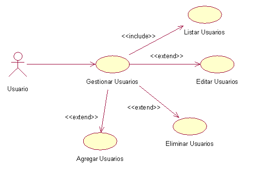
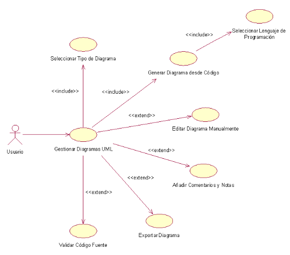
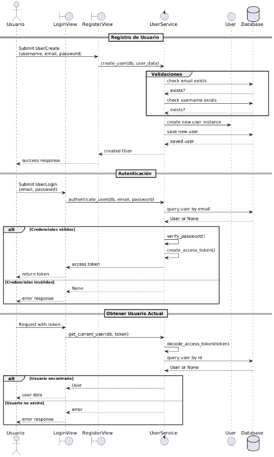
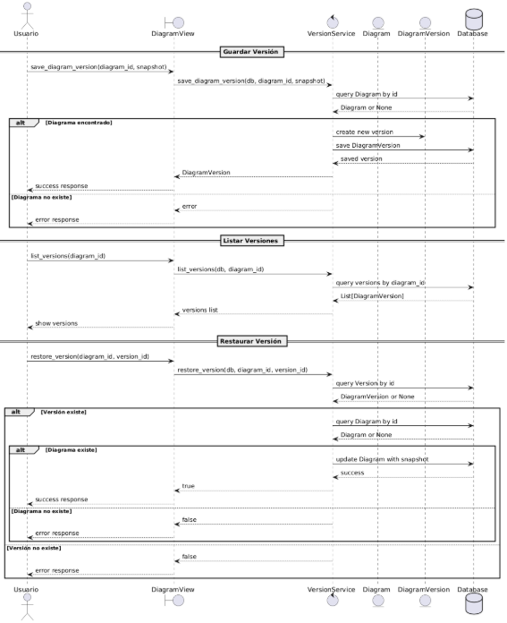
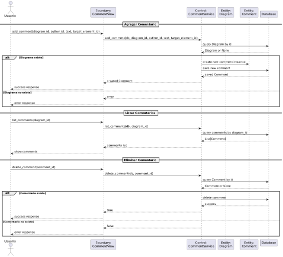
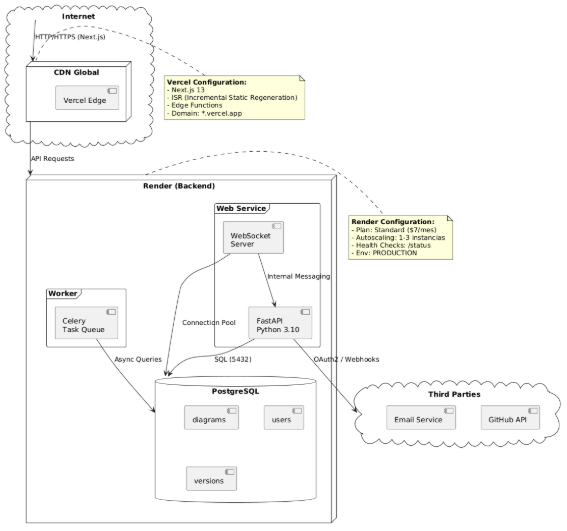

**UNIVERSIDAD PRIVADA DE TACNA**

**FACULTAD DE INGENIERÍA**

**Escuela Profesional de Ingeniería de Sistemas**

**Plataforma Avanzada para la Generación Automática de Diagramas UML para la empresa Tech Solutions**

Curso: Patrones de Software

Docente: Mag. Patrick Cuadrados

Integrantes:

\- Alexis Jeanpierre Martínez Vargas			(2019063638)

\- Juan José David Pérez Vizcarra				(2019063636)

\- Jhon Thomas Ticona Chambi				(2018062232)

**Tacna-Perú**

**2025**

**

|CONTROL DE VERSIONES||||||
| :-: | :- | :- | :- | :- | :- |
|Versión|Hecha por|Revisada por|Aprobada por|Fecha|Motivo|
|1\.0|MPV|ELV|ARV|10/10/2020|Versión Original|

**Plataforma Avanzada para la Generación Automática de Diagramas UML para la empresa Tech Solutions**

**Documento de Arquitectura de Software**

**Versión *1.0***

***Presentado Por:***

*Ticona Chambi, Jhon*

*Documentador*

*2025*

**

|CONTROL DE VERSIONES||||||
| :-: | :- | :- | :- | :- | :- |
|Versión|Hecha por|Revisada por|Aprobada por|Fecha|Motivo|
|1\.0|JTC|AMV, JTC|AMV|26/04/2025|Versión Inicial|

INDICE GENERAL

#
[**1.***	***INTRODUCCIÓN	5******](#_toc69808834)***

[**1.1.**	**Propósito (Diagrama 4+1)	5****](#_toc69808835)

[**1.2.**	**Alcance	5****](#_toc69808836)

[**1.3.**	**Definición, siglas y abreviaturas	5****](#_toc69808837)

[**1.4.**	**Organización del documento	5****](#_toc69808838)

[***2.***	***OBJETIVOS Y RESTRICCIONES ARQUITECTONICAS	5******](#_toc69808839)

[2.1.1.	Requerimientos Funcionales	5](#_toc69808840)

[2.1.2.	Requerimientos No Funcionales – Atributos de Calidad	5](#_toc69808841)

[***3.***	***REPRESENTACIÓN DE LA ARQUITECTURA DEL SISTEMA	6******](#_toc69808842)

[**3.1.**	**Vista de Caso de uso	6****](#_toc69808843)

[3.1.1.	Diagramas de Casos de uso	6](#_toc69808844)

[**3.2.**	**Vista Lógica	6****](#_toc69808845)

[3.2.1.	Diagrama de Subsistemas (paquetes)	7](#_toc69808846)

[3.2.2.	Diagrama de Secuencia (vista de diseño)	7](#_toc69808847)

[3.2.3.	Diagrama de Colaboración (vista de diseño)	7](#_toc69808848)

[3.2.4.	Diagrama de Objetos	7](#_toc69808849)

[3.2.5.	Diagrama de Clases	7](#_toc69808850)

[3.2.6.	Diagrama de Base de datos (relacional o no relacional)	7](#_toc69808851)

[**3.3.**	**Vista de Implementación (vista de desarrollo)	7****](#_toc69808852)

[3.3.1.	Diagrama de arquitectura software (paquetes)	7](#_toc69808853)

[3.3.2.	Diagrama de arquitectura del sistema (Diagrama de componentes)	7](#_toc69808854)

[**3.4.**	**Vista de procesos	7****](#_toc69808855)

[3.4.1.	Diagrama de Procesos del sistema (diagrama de actividad)	8](#_toc69808856)

[**3.5.**	**Vista de Despliegue (vista física)	8****](#_toc69808857)

[3.5.1.	Diagrama de despliegue	8](#_toc69808858)

[***4.***	***ATRIBUTOS DE CALIDAD DEL SOFTWARE	8******](#_toc69808859)

[**Escenario de Funcionalidad	8****](#_toc69808860)

[**Escenario de Usabilidad	8****](#_toc69808861)

[**Escenario de confiabilidad	9****](#_toc69808862)

[**Escenario de rendimiento	9****](#_toc69808863)

[**Escenario de mantenibilidad	9****](#_toc69808864)

[**Otros Escenarios	9****](#_toc69808865)

1. INTRODUCCIÓN

1. Propósito

El propósito de este documento es presentar la arquitectura del sistema "Plataforma Avanzada para la Generación Automática de Diagramas UML" para la empresa Tech Solutions, utilizando el modelo de vistas 4+1. Este enfoque permite describir la arquitectura desde diferentes perspectivas, asegurando que cumpla con los requisitos funcionales y no funcionales identificados en el documento SRS.

1. Alcance

` `Este documento se centrará en:

- La vista lógica del sistema, detallando los componentes principales (módulo de generación UML, módulo de colaboración).
- Aspectos clave de las demás vistas, como la vista de procesos para la edición en tiempo real y la vista física para la infraestructura básica.
- Se omitirán detalles de bajo nivel, como configuraciones específicas de servidores o implementaciones de plugins.
  1. Definición, siglas y abreviaturas
- UML Unified Modeling Language: Lenguaje estándar para modelado visual de sistemas software.
- JSON/YAML	Formatos de intercambio de datos utilizados para importar/exportar modelos de diagramas.
- Git	Sistema de control de versiones integrado para generar diagramas basados en cambios de código.
- RUP	Rational Unified Process: Metodología utilizada para el desarrollo del sistema.
- RF	Requerimiento Funcional (RF-01 para selección de diagramas).
- Rnf	Requerimiento No Funcional (Rnf01 para rendimiento).
- CUS	Caso de Uso del Sistema ("Generar UML").
- BR	Regla de Negocio (RN01 para registro de usuarios).
  1. Organización del documento

1. # **OBJETIVOS Y RESTRICCIONES ARQUITECTONICAS**

1. Priorización de requerimientos
   1. ### Requerimientos Funcionales

<table><tr><th><b>Nombre</b></th><th><b>Código</b></th><th><b>Descripción</b></th><th><b>Sistema</b></th><th><b>Prioridad</b></th></tr>
<tr><td>RF-01</td><td rowspan="2"><b>Selección de Opciones</b></td><td>Elegir el tipo de diagrama UML a generar: Clases, Secuencia, Casos de Uso, Componentes.</td><td>Plataforma Web</td><td>Alta</td></tr>
<tr><td>RF-02</td><td>Soporte para múltiples lenguajes de programación (C#, Java, Python, etc.).</td><td>Plataforma Web</td><td>Alta</td></tr>
<tr><td>RF-03</td><td><b>Generación de UML</b></td><td>Convertir automáticamente el código pegado en un diagrama UML con vista previa en tiempo real.</td><td>Plataforma Web</td><td>Alta</td></tr>
<tr><td>RF-04</td><td><b>Edición y Personalización</b></td><td>Permitir la edición manual del diagrama generado, añadiendo o eliminando nodos, relaciones o notas.</td><td>Plataforma Web</td><td>Alta</td></tr>
<tr><td>RF-05</td><td><b>Colaboración</b></td><td>Permitir compartir diagramas UML en tiempo real con otros usuarios para edición conjunta.</td><td>Plataforma Web</td><td>Media</td></tr>
<tr><td>RF-06</td><td><b>Exportación</b></td><td>Guardar diagramas en diferentes formatos: PNG, SVG, PDF o en código PlantUML/Mermaid.</td><td>Plataforma Web</td><td>Alta</td></tr>
<tr><td>RF-07</td><td><b>Historial y Versionado</b></td><td>Permitir la reversión a versiones anteriores del diagrama para recuperar cambios previos.</td><td>Plataforma Web</td><td>Media</td></tr>
<tr><td>RF-08</td><td><b>Comentarios y Notas</b></td><td>Posibilidad de añadir anotaciones o notas técnicas a los elementos del diagrama UML.</td><td>Plataforma Web</td><td>Baja</td></tr>
<tr><td>RF-09</td><td><b>Validaciones</b></td><td>Alertar si el código pegado tiene errores de sintaxis que impiden la generación del diagrama.</td><td>Plataforma Web</td><td>Alta</td></tr>
<tr><td>RF-10</td><td><b>Seguridad y Acceso</b></td><td>Implementar autenticación de usuarios con roles de acceso (Invitado, Usuario, Administrador).</td><td>Plataforma Web</td><td>Alta</td></tr>
</table>

1. ### Requerimientos No Funcionales – Atributos de Calidad

<table><tr><th><b>Nro. Rnf</b></th><th><b>Requerimientos no Funcional</b></th><th><b>Descripción del Requerimiento No Funcional</b></th></tr>
<tr><td rowspan="2">Rnf01</td><td rowspan="2">Rendimiento</td><td>El sitio web debe tener un tiempo de carga máximo de 2 segundos para garantizar una experiencia de usuario fluida.</td></tr>
<tr><td>El sistema debe ser capaz de manejar hasta 1000 usuarios concurrentes sin degradación significativa del rendimiento.</td></tr>
<tr><td rowspan="2">Rnf02</td><td rowspan="2">Seguridad</td><td>El sitio web debe implementar medidas de seguridad, como cifrado SSL, para proteger los datos de los usuarios.</td></tr>
<tr><td>Debe haber una política de contraseñas seguras que requiera contraseñas fuertes para los usuarios registrados.</td></tr>
<tr><td>Rnf03</td><td>Disponibilidad</td><td>El sitio web debe estar disponible las 24 horas del día, los 7 días de la semana, con un tiempo de inactividad planificado mínimo.</td></tr>
<tr><td rowspan="2">Rnf04</td><td rowspan="2">Usabilidad</td><td>El diseño y la interfaz de usuario del sitio web deben ser intuitivos y fáciles de usar para niños, con elementos visuales atractivos.</td></tr>
<tr><td>El sitio debe ser accesible desde dispositivos móviles y tabletas, además de computadoras de escritorio.</td></tr>
<tr><td>Rnf05</td><td>Compatibilidad</td><td>El sitio web debe ser compatible con los principales navegadores web, como Chrome, Firefox, Edge y Safari.</td></tr>
</table>

1. Restricciones

1. # **REPRESENTACIÓN DE LA ARQUITECTURA DEL SISTEMA**

1. Vista de Caso de uso

1. ### Diagramas de Casos de uso

*Figura 6: Diagrama de Caso de Uso del Módulo Iniciar Sesión incluyendo la acción de validar Usuario*

*Fuente: Elaboración Propia*

*Figura 7: Diagrama de Caso de Uso del Modulo Gestionar Usuario que incluye la acción de Listar usuario y extensión de acciones de tipo Editar Usuarios, Agregar Usuarios y Eliminar Usuarios.*

*Fuente: Elaboración Propia*

*Figura 8: Diagrama de Caso de Uso del Módulo Gestionar Colaboración en Diagramas que incluye la acción de Compartir Diagrama en Tiempo Real y la extensión de Gestionar Historial de Versiones.*

*Fuente: Elaboración Propia*

*Figura 9: Diagrama de Caso de Uso del Módulo Gestionar Diagramas UML que incluye las acciones de Seleccionar Tipo de Diagrama y Generar Diagrama desde Código este a su vez incluye Seleccionar Lenguaje de Programación por otor lado en las extensiones son Editar Diagrama Manualmente, Añadir Comentarios, Exportar Diagrama y Validar Código Fuente.*

*Fuente: Elaboración Propia*

1. Vista Lógica

1. ### Diagrama de Subsistemas (paquetes)
Este diagrama organiza el sistema en módulos lógicos (paquetes) según su funcionalidad, mostrando las dependencias entre ellos para garantizar una arquitectura escalable y mantenible. Se estructura en tres capas principales:

1. ### Diagrama de Secuencia (vista de diseño)
Diagrama de secuencia de colaboración 

Diagrama de secuencia de generación  de UML

Diagrama de secuencia de autenticación 

Diagrama de secuencia de versiona miento 

Diagrama de secuencia de Comentarios

1. ### Diagrama de Colaboración (vista de diseño)

1. ### Diagrama de Clases
El Diagrama de Clases es una representación estática de la estructura del sistema, donde se modelan las clases principales, sus atributos, métodos y las relaciones entre ellas (herencia, asociación, composición, etc.). Este diagrama es fundamental para el diseño orientado a objetos, ya que define la arquitectura lógica del software antes de su implementación.

1. ### Diagrama de Base de datos (relacional o no relacional)
Representa el esquema de datos (relacional o NoSQL), incluyendo tablas como Diagram, DiagramVersion y Comment, con claves primarias/foráneas y restricciones, para guiar la implementación física de la persistencia.

1. Vista de Implementación (vista de desarrollo)
   1. ### Diagrama de arquitectura software (paquetes)
Este diagrama representa la estructura modular del sistema, organizando los componentes principales en paquetes lógicos (ej: autenticación, diagramación, comentarios) y sus dependencias. Muestra cómo interactúan los módulos entre sí (ej: el paquete comentarios depende de diagramación), facilitando la comprensión de responsabilidades y acoplamiento. Incluye capas como presentación, lógica de negocio y persistencia, alineándose con patrones de diseño. Su propósito es guiar el desarrollo, mantenimiento y escalabilidad del código.

1. ### Diagrama de arquitectura del sistema (Diagrama de componentes)
Este diagrama representa los componentes software reutilizables del sistema (ej: servicios, APIs, librerías) y sus interfaces de comunicación, mostrando cómo se integran entre sí y con sistemas externos (como bases de datos o autenticación de terceros). Cada componente se define por su función técnica (ej: CommentService, AuthAPI) y se conecta mediante interfaces estandarizadas (REST, gRPC, eventos). Su objetivo es visualizar la arquitectura técnica, facilitando el despliegue, la escalabilidad y el reemplazo de tecnologías.

1. Vista de procesos

1. ### Diagrama de Procesos del sistema (diagrama de actividad)

Diagrama de actividades - colaboración

Diagrama de actividades – Generar diagrama UML

Diagrama de actividades - Autenticación

Diagrama de actividades de Versiones

Diagrama de actividades – Comentarios

1. Vista de Despliegue (vista física)

1. ### Diagrama de despliegue
Este diagrama describe la infraestructura física y virtual donde se ejecuta el sistema, mostrando servidores (nodos), contenedores, servicios en la nube y dispositivos involucrados. Especifica cómo los componentes de software (frontend, backend, bases de datos) se distribuyen en estos entornos, incluyendo tecnologías concretas y protocolos de comunicación (HTTP, TCP/IP). Su propósito es guiar la instalación, escalabilidad y gestión operativa del sistema en producción, reflejando requisitos de disponibilidad, seguridad y rendimiento.

1. # **ATRIBUTOS DE CALIDAD DEL SOFTWARE**

Los Atributos de Calidad (Quality Attributes, QAs) son propiedades medibles y evaluables que describen el comportamiento del sistema más allá de su funcionalidad principal. Mientras que los requerimientos funcionales indican qué hace un sistema, los QAs indican cómo lo hace, y qué tan bien cumple con las expectativas de los stakeholders en aspectos como rendimiento, seguridad, usabilidad, y mantenibilidad.

Según [Wojcik, 2013], los QAs son considerados requerimientos no funcionales. Un sistema puede funcionar correctamente en términos funcionales, pero aún así fallar si no cumple con ciertos atributos de calidad.

A continuación, se describen los principales escenarios asociados a cada atributo de calidad:

Escenario de Funcionalidad

Evalúa las capacidades, características y alcance del sistema.

Considera:

- Cobertura de funciones.
- Generalidad y completitud de operaciones.
- Seguridad lógica de las funciones ofrecidas.

Escenario de Usabilidad

Define la facilidad de uso e interacción del sistema por parte del usuario final.

Incluye:

- Facilidad de aprendizaje.
- Facilidad de uso cotidiano.
- Adaptabilidad a usuarios y tareas.
- Reducción de errores y ayuda al usuario.
- Confianza y satisfacción del usuario.

Escenario de Confiabilidad / Seguridad

Mide la capacidad del sistema para mantener la integridad, disponibilidad y confidencialidad de los datos.

Abarca:

- Prevención: minimizar vulnerabilidades.
- Precaución: detección anticipada de amenazas.
- Reacción: respuesta ante incidentes.
- Enfoques: físico, lógico y humano.

Escenario de Rendimiento

Evalúa la eficiencia del sistema bajo carga.

Métricas clave:

- Tiempo de respuesta.
- Velocidad de procesamiento.
- Uso de recursos (memoria, CPU, red).
- Capacidad de manejo de eventos concurrentes.

Escenario de Mantenibilidad

Se refiere a la facilidad con que el sistema puede ser modificado, ampliado o adaptado.

Subatributos:

- Extensibilidad.
- Adaptabilidad.
- Facilidad de diagnóstico y corrección.
2

