# Plataforma Avanzada para Generación Automática de Diagramas UML  
**Tech Solutions**  
*Patrones de Software - Mag. Patrick Cuadros*  

---

## Integrantes  
- Alexis Martínez Vargas (2019063638)  
- Juan Pérez Vizcarra (2019063636)  
- Jhon Ticona Chambi (2018062232)  

---

## 1. Introducción  
### Propósito  
Arquitectura del sistema basada en modelo **4+1** para cumplir con:  
- Requerimientos funcionales (RF-01 a RF-10)  
- Atributos de calidad (Rnf01-Rnf05)  

### Alcance  
- **Incluye**:  
  - Vista lógica (módulos UML y colaboración)  
  - Vista de procesos (edición en tiempo real)  
- **Excluye**: Configuraciones de servidores específicos  

---

## 2. Arquitectura del Sistema  
### Vista de Casos de Uso  
**Diagramas clave**:  
- Generación de UML desde código  
- Colaboración en tiempo real  

  
*Figura: Módulo de Gestión de Diagramas UML*  

---

### Vista de Caso de uso

Diagrama de Caso de Uso del Módulo Iniciar Sesión incluyendo la acción de validar Usuario*

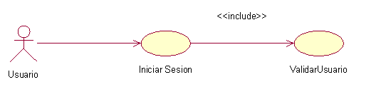

---

Diagrama de Caso de Uso del Modulo Gestionar Usuario

---

Diagrama de Caso de Uso del Módulo Gestionar Colaboración

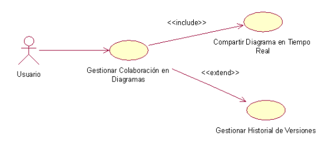

---

Diagrama de Caso de Uso del Módulo Gestionar Diagramas UML

---

## Vista Lógica

### Diagrama de Subsistemas (paquetes)

---

### Diagrama de Secuencia 
#### Diagrama de secuencia de colaboración 

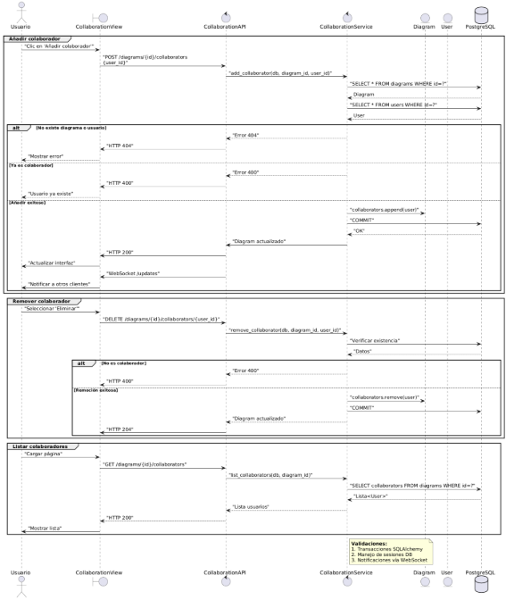

---

#### Diagrama de secuencia de generación  de UML

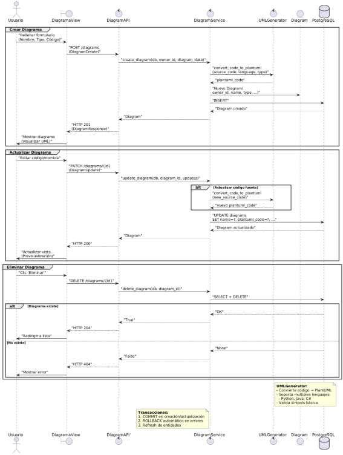

---

#### Diagrama de secuencia de autenticación 

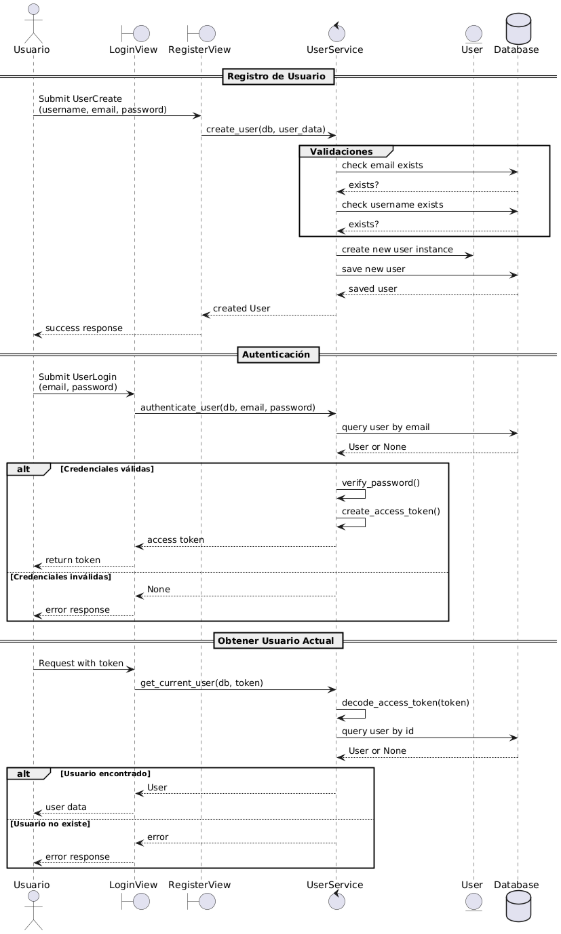

---

#### Diagrama de secuencia de versiona miento 

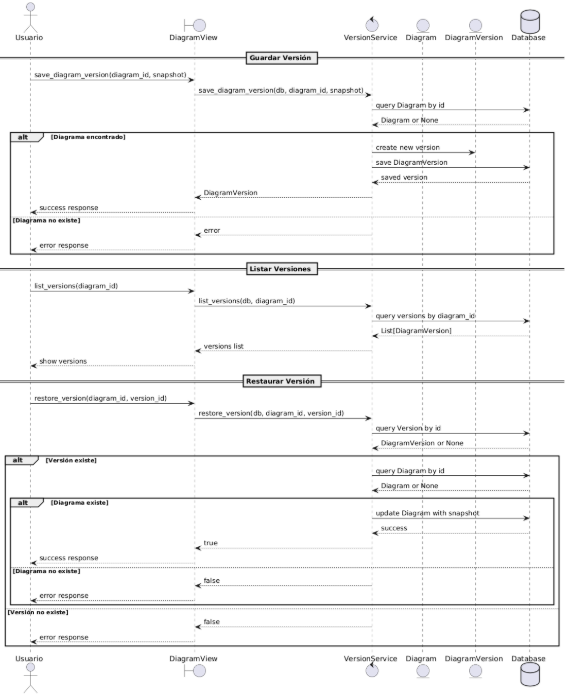

---

#### Diagrama de secuencia de Comentarios

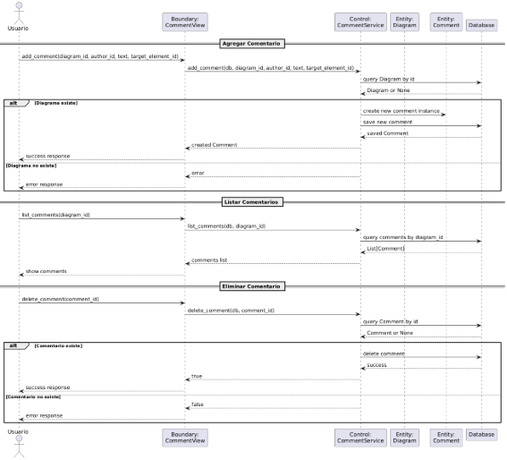

---

### Diagrama de Clases

---

### Diagrama de Base de datos

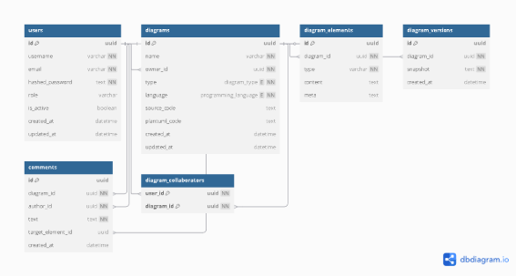

---

### Diagrama de arquitectura software

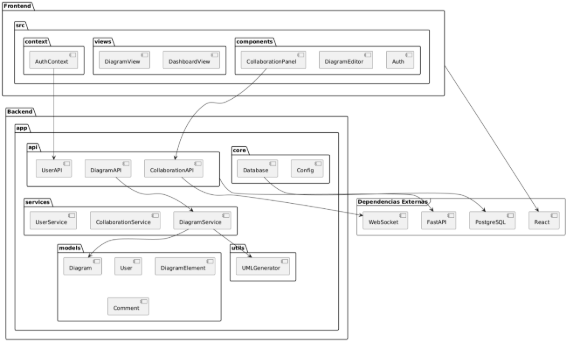

---

### Diagrama de arquitectura del sistema

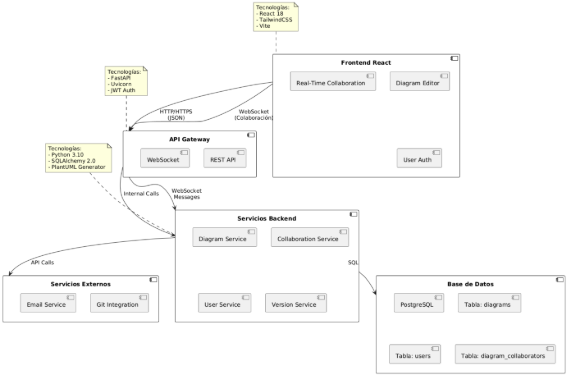

---

### Diagrama de despliegue

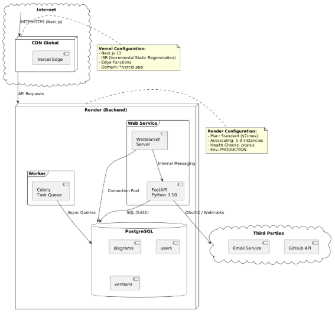
